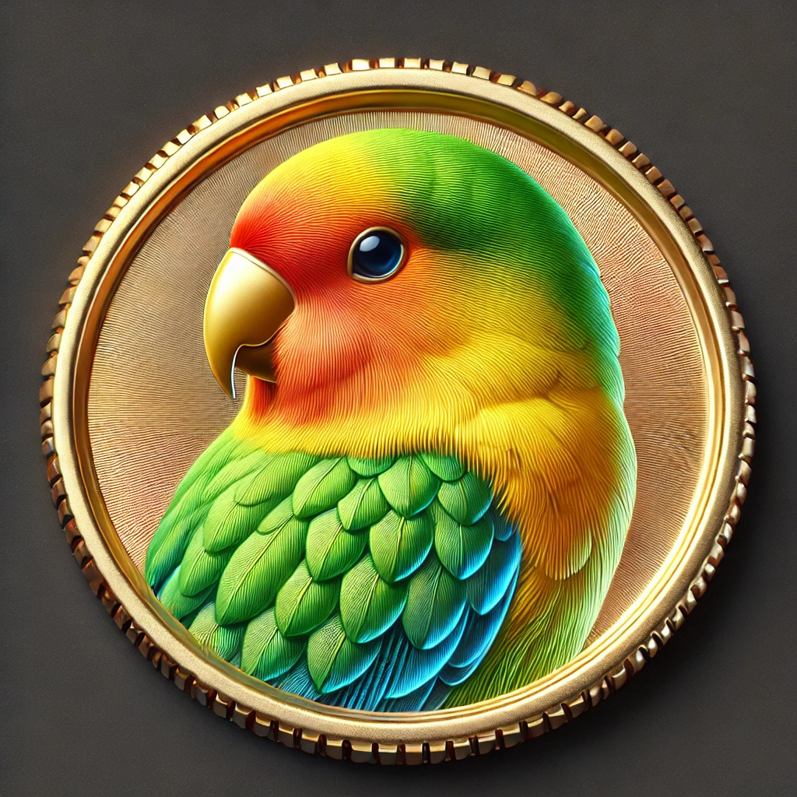

# Lovebirds Ecosystem: DUSD & DUDU

The **Lovebirds Ecosystem** is a blockchain-based system inspired by the themes of love and freedom. It features two tokens: **DUSD**, a stablecoin representing love and freedom that DUDU seeks to protect, and **DUDU**, a meme utility token symbolizing the playful and vibrant nature of the Lovebirds family.

---

## DUSD: The Stablecoin

### Stability Mechanism

1. **Dual Collateral Model**

   - **Stable Collateral (USDT)**: 20%, providing baseline value stability.
   - **Volatile Collateral (DUDU)**: 80%, enhancing capital efficiency.

2. **Algorithmic Stability**
   - Dynamic adjustments via minting or burning DUDU when value deviates to maintain the peg.

### Use Cases

1. **Cross-Border Payments**

   - Enable fast, low-cost international transactions using DUSD.

2. **Ecosystem Settlement**
   - Serve as the stable transaction medium within the DUDU ecosystem for purchasing services or redeeming physical goods.

### Transparency

- Establish an **on-chain reserve auditing system** to allow users to verify the reserve status of DUSD at any time.

### Tokenomics

- **Initial Supply**: 1,000,000 DUSD.
- **Gradual Expansion**: Small portions of tokens issued annually to support ecosystem growth, such as cross-chain integrations and payment system upgrades.

---

## DUDU: The Meme Utility Token

### Brand & Functionality

1. **Brand Attributes**

   - **DUDU** represents the youthful and lively spirit of the Lovebirds family, driving community participation and entertainment.

2. **Functional Attributes**
   - **Community Governance**: DUDU holders participate in ecosystem decisions, such as voting on new features.
   - **Discounts & Rewards**: Use DUDU to pay transaction fees at a discount or earn it as rewards for participating in ecosystem activities.

### Future Prospects

1. **NFT Integration**
   - Issue **limited edition Lovebirds NFTs**, giving DUDU holders free minting opportunities or priority access.

### Tokenomics

- **Total Supply**: 1,000,000,000 DUDU.
- **Allocation**:
  - **Community Incentives**: 10% (airdrops, activity rewards).
  - **Ecosystem Fund**: 70% (support application development and partnerships).
  - **Liquidity Mining**: 10% (incentivize liquidity providers).
  - **Team & Advisors**: 10% (with vesting periods for trust-building).

### Price Stability Measures

1. **Buy-Back Mechanism**

   - Utilize DUSD to buy back DUDU when the price drops significantly.

2. **Community Engagement**
   - Promote active participation through campaigns and events to stabilize market demand.

---

## Lovebirds: The Brand Identity

The **Lovebirds** theme unites DUSD and DUDU, embodying the harmony of stability and playfulness.

### Visual Design

- **DUSD**:   
  DUSD is the stablecoin in the ecosystem, symbolized by a calm and gentle Lovebird dedicated to protecting "love and freedom." Its design reflects the power of love and stability.
- **DUDU**:   
  DUDU represents a pair of lively and fun-loving Lovebirds, embodying the joy and vitality of love. This cheerful couple brings laughter to the community while playing a central role in the ecosystem's entertainment functions.

---

## How to Get Started

1. **Acquire DUSD**:

   - Use for stable payments and as a store of value in the Lovebirds ecosystem.

2. **Join the DUDU Community**:

   - Participate in governance, unlock rewards, and collect Lovebirds NFTs.

3. **Stay Updated**:
   - Follow our social media channels and website for the latest news, campaigns, and updates.

---

## Contributing

We welcome contributions from the community to expand the Lovebirds ecosystem. Whether you’re a developer, artist, or enthusiast, your ideas and efforts can make a difference. Reach out to us through our official channels.

---

## License

This project is licensed under the [MIT License](LICENSE).
